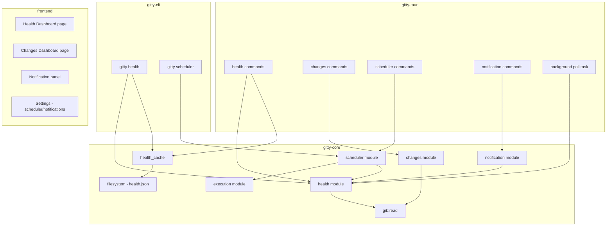

# M5: Health, Dashboard & Automation — Design

**Spec**: `.specs/features/m5-health-automation/spec.md`
**Status**: Draft

---

## Architecture Overview

M5 adds four new `gitty-core` modules (`health`, `changes`, `scheduler`, `notification`) plus corresponding Tauri IPC commands and frontend pages. The Scheduler is the only component that spans process boundaries (GUI tokio task OR CLI daemon per ADR-0008).



---

## Code Reuse Analysis

### Existing Components to Leverage

| Component | Location | How to Use |
| --- | --- | --- |
| `git::read::read_status()` | `crates/gitty-core/src/git/read.rs` | Health checks consume `RepositoryStatus` directly |
| `git::read::RepositoryStatus` | same | Input type for all Health Check evaluations |
| `git::read::CommitSummary` | same | Stale check uses `date` field; Changes module extends revwalk |
| `execution::execute_macro()` | `crates/gitty-core/src/execution.rs` | Scheduler invokes this to run the configured Macro |
| `config::Config` | `crates/gitty-core/src/config/mod.rs` | New fields for thresholds, scheduler, notifications (serde default) |
| `config::paths::config_dir()` | `crates/gitty-core/src/config/paths.rs` | Location for `health.json` and scheduler PID file |
| `lock` module pattern | `crates/gitty-core/src/lock.rs` | Reuse PID-file + stale-detection pattern for scheduler lock |
| `Repository`, `Workspace` | `crates/gitty-core/src/repository.rs` | Iterate repos for health/changes evaluation |
| `MacroDef`, `Selection` | `crates/gitty-core/src/macro_def.rs`, `selection.rs` | Scheduler selects repos and runs macros |
| CSS design tokens | `src/lib/styles/tokens.css` | Health indicators use existing color system |

### Integration Points

| System | Integration Method |
| --- | --- |
| Config (persistence) | New `#[serde(default)]` fields on `Workspace` for thresholds + on `Config` for scheduler/notifications |
| Tauri managed state | Health cache + scheduler state accessed via `State<Mutex<...>>` (ADR-0007 pattern from M4) |
| CLI clap commands | New `health` and `scheduler` subcommands with subcommands |
| Frontend routing | New `/health` and `/changes` routes + notification panel in AppShell |

---

## Components

### `health` module

- **Purpose**: Evaluate Repositories against pluggable Health Checks; compute aggregate Workspace Health score.
- **Location**: `crates/gitty-core/src/health.rs`
- **Interfaces**:
  - `trait HealthCheck` — `fn id(&self) -> &str`, `fn evaluate(&self, status: &RepositoryStatus, thresholds: &HealthThresholds) -> CheckResult`
  - `struct StaleCheck` — implements `HealthCheck`; compares HEAD date to threshold
  - `struct DivergedCheck` — implements `HealthCheck`; checks `upstream.behind`
  - `struct DirtyCheck` — implements `HealthCheck`; checks `dirty` field
  - `struct DetachedCheck` — implements `HealthCheck`; checks `detached` field
  - `fn evaluate_repository(repo: &Repository, checks: &[&dyn HealthCheck], thresholds: &HealthThresholds) -> RepositoryHealth` — runs all checks on one repo
  - `fn evaluate_workspace(repos: &[Repository], checks: &[&dyn HealthCheck], thresholds: &HealthThresholds) -> WorkspaceHealth` — evaluates all, computes score
- **Dependencies**: `git::read`, `repository`, `time` crate
- **Reuses**: `git::read::read_status()` for input data, `RepositoryState` for Missing filtering

### `health_cache` module

- **Purpose**: Persist and load health evaluation results via `health.json`.
- **Location**: `crates/gitty-core/src/health_cache.rs`
- **Interfaces**:
  - `fn save(health: &WorkspaceHealth, dir: &Path) -> Result<()>` — atomic write with file lock
  - `fn load(dir: &Path) -> Result<Option<CachedHealth>>` — returns None if file missing
  - `struct CachedHealth` — `last_evaluated: OffsetDateTime`, `workspace_health: WorkspaceHealth`
- **Dependencies**: `config::paths`, `serde_json`, `time`, `fs2` (file locking)
- **Reuses**: Config's atomic temp+rename write pattern

### `changes` module

- **Purpose**: Scan commit history across Repositories for the Change Dashboard.
- **Location**: `crates/gitty-core/src/changes.rs`
- **Interfaces**:
  - `struct ChangeEntry` — `commit_hash: String`, `author: String`, `date: OffsetDateTime`, `subject: String`, `branch: String`, `repo_id: Uuid`, `repo_name: String`
  - `enum TimeWindow` — `Day`, `Week`, `Month`
  - `enum Grouping` — `Author`, `Repository`, `Branch`
  - `fn scan_changes(repos: &[&Repository], window: TimeWindow, all_branches: &HashSet<Uuid>) -> Result<Vec<ChangeEntry>>` — main scan function
  - `fn group_changes(entries: &[ChangeEntry], by: Grouping) -> BTreeMap<String, Vec<&ChangeEntry>>` — pure grouping logic
- **Dependencies**: `git2`, `time`, `repository`
- **Reuses**: `git2::Repository::open()` pattern from `git::read`

### `scheduler` module

- **Purpose**: Background automation engine — evaluates triggers and executes Macros.
- **Location**: `crates/gitty-core/src/scheduler.rs`
- **Interfaces**:
  - `struct SchedulerConfig` — `enabled: bool`, `macro_id: Option<Uuid>`, `trigger: SchedulerTrigger`, `power: PowerConfig`, `last_run: Option<OffsetDateTime>`, `next_run: Option<OffsetDateTime>`
  - `enum SchedulerTrigger` — `Simple { interval_minutes: u32 }`, `Advanced { interval_minutes: u32, window_start: NaiveTime, window_end: NaiveTime, days: Vec<Weekday> }`
  - `struct PowerConfig` — `pause_on_battery: bool`, `battery_threshold: u8` (percentage, default 20)
  - `fn should_run(config: &SchedulerConfig, now: OffsetDateTime, on_battery: bool, battery_level: u8) -> bool` — pure trigger logic
  - `fn record_run(config: &mut SchedulerConfig, now: OffsetDateTime)` — updates last_run, computes next_run
  - `fn compute_next_run(config: &SchedulerConfig, from: OffsetDateTime) -> Option<OffsetDateTime>`
- **Dependencies**: `time`, `execution`, `health`
- **Reuses**: Execution engine for macro runs; Lock module pattern for PID file

### `scheduler::daemon` (CLI-only)

- **Purpose**: Self-daemonizing process management for CLI scheduler.
- **Location**: `crates/gitty-core/src/scheduler/daemon.rs`
- **Interfaces**:
  - `fn start(config_dir: &Path) -> Result<()>` — fork/detach, write PID, enter loop
  - `fn stop(config_dir: &Path) -> Result<()>` — read PID, send signal
  - `fn status(config_dir: &Path) -> Result<SchedulerStatus>` — check PID liveness
  - `struct SchedulerStatus` — `running: bool`, `pid: Option<u32>`, `last_run: Option<OffsetDateTime>`, `next_run: Option<OffsetDateTime>`
- **Dependencies**: Platform-specific APIs (fork on Unix, CreateProcess on Windows), `config::paths`
- **Reuses**: Lock module's PID file + stale detection pattern

### `notification` module

- **Purpose**: Generate, store, and manage Notification records.
- **Location**: `crates/gitty-core/src/notification.rs`
- **Interfaces**:
  - `struct Notification` — `id: Uuid`, `timestamp: OffsetDateTime`, `severity: Severity`, `title: String`, `body: String`, `read: bool`
  - `enum Severity` — `Info`, `Warning`, `Critical`
  - `enum NotificationTrigger` — `OnCritical`, `OnAnyChange`, `OnSchedulerComplete`, `Disabled`
  - `struct NotificationConfig` — `trigger: NotificationTrigger`, `polling_interval_minutes: Option<u32>`
  - `fn generate_health_notification(prev: &WorkspaceHealth, current: &WorkspaceHealth, trigger: NotificationTrigger) -> Option<Notification>` — aggregate logic
  - `fn purge_expired(notifications: &mut Vec<Notification>, ttl_days: u32)` — removes entries older than TTL
- **Dependencies**: `health`, `time`, `uuid`
- **Reuses**: None (new domain)

### Tauri IPC Commands (new)

- **Purpose**: Expose M5 functionality to the frontend.
- **Location**: `src-tauri/src/commands/health.rs`, `src-tauri/src/commands/changes.rs`, `src-tauri/src/commands/scheduler.rs`, `src-tauri/src/commands/notifications.rs`
- **Interfaces**:
  - `get_workspace_health() -> Result<WorkspaceHealthDto, ErrorDto>`
  - `get_repository_health(repo_id: String) -> Result<RepositoryHealthDto, ErrorDto>`
  - `refresh_health() -> Result<WorkspaceHealthDto, ErrorDto>`
  - `get_changes(window: String, grouping: String, all_branches_repos: Vec<String>) -> Result<ChangesDto, ErrorDto>`
  - `get_scheduler_status() -> Result<SchedulerStatusDto, ErrorDto>`
  - `set_scheduler_config(config: SchedulerConfigDto) -> Result<(), ErrorDto>`
  - `get_notifications() -> Result<Vec<NotificationDto>, ErrorDto>`
  - `mark_notification_read(id: String) -> Result<(), ErrorDto>`
  - `get_notification_config() -> Result<NotificationConfigDto, ErrorDto>`
  - `set_notification_config(config: NotificationConfigDto) -> Result<(), ErrorDto>`
- **Dependencies**: Tauri managed state, gitty-core modules
- **Reuses**: Existing command pattern from M3/M4 commands

### Frontend Pages

- **Purpose**: Visual interfaces for health, changes, and notifications.
- **Location**: `src/routes/health/+page.svelte`, `src/routes/changes/+page.svelte`, notification panel in `src/lib/components/`
- **Dependencies**: Tauri `invoke()`, design tokens from `tokens.css`
- **Reuses**: Existing page layout patterns, stats cards from workspace dashboard, table components

---

## Data Models

### Rust (gitty-core)

```rust
// health.rs
pub enum CheckSeverity { Healthy, Warning, Critical }

pub struct CheckResult {
    pub check_id: String,
    pub severity: CheckSeverity,
    pub message: String,
}

pub struct RepositoryHealth {
    pub repo_id: Uuid,
    pub checks: Vec<CheckResult>,
    pub worst_severity: CheckSeverity,
}

pub struct WorkspaceHealth {
    pub score: f64,  // 0.0–100.0
    pub total_repos: usize,
    pub critical_count: usize,
    pub warning_count: usize,
    pub healthy_count: usize,
    pub repositories: Vec<RepositoryHealth>,
}

pub struct HealthThresholds {
    pub stale_days_warning: u32,       // default 7
    pub stale_days_critical: u32,      // default 14
    pub diverged_warning: usize,       // default 5
    pub diverged_critical: usize,      // default 20
}
```

```rust
// changes.rs
pub struct ChangeEntry {
    pub commit_hash: String,
    pub author: String,
    pub date: OffsetDateTime,
    pub subject: String,
    pub branch: String,
    pub repo_id: Uuid,
    pub repo_name: String,
}
```

```rust
// scheduler.rs
pub struct SchedulerConfig {
    pub enabled: bool,
    pub macro_id: Option<Uuid>,
    pub trigger: SchedulerTrigger,
    pub power: PowerConfig,
    pub last_run: Option<OffsetDateTime>,
    pub next_run: Option<OffsetDateTime>,
}

pub enum SchedulerTrigger {
    Simple { interval_minutes: u32 },
    Advanced {
        interval_minutes: u32,
        window_start: String,  // "HH:MM"
        window_end: String,    // "HH:MM"
        days: Vec<String>,     // "mon", "tue", etc.
    },
}

pub struct PowerConfig {
    pub pause_on_battery: bool,
    pub battery_threshold: u8,
}
```

```rust
// notification.rs
pub struct Notification {
    pub id: Uuid,
    pub timestamp: OffsetDateTime,
    pub severity: Severity,
    pub title: String,
    pub body: String,
    pub read: bool,
}

pub struct NotificationConfig {
    pub trigger: NotificationTrigger,
    pub polling_interval_minutes: Option<u32>,
}
```

### Config additions (via `#[serde(default)]`)

```rust
// Added to Workspace struct
pub health_thresholds: HealthThresholds,

// Added to Config struct
pub scheduler: SchedulerConfig,
pub notifications: NotificationConfig,
pub notification_history: Vec<Notification>,
```

### TypeScript (frontend DTOs)

```typescript
interface WorkspaceHealthDto {
  score: number;
  totalRepos: number;
  criticalCount: number;
  warningCount: number;
  healthyCount: number;
  repositories: RepositoryHealthDto[];
  lastEvaluated: string | null;  // RFC3339
}

interface RepositoryHealthDto {
  repoId: string;
  repoName: string;
  checks: CheckResultDto[];
  worstSeverity: 'healthy' | 'warning' | 'critical';
}

interface CheckResultDto {
  checkId: string;
  severity: 'healthy' | 'warning' | 'critical';
  message: string;
}

interface ChangeEntryDto {
  commitHash: string;
  author: string;
  date: string;
  subject: string;
  branch: string;
  repoId: string;
  repoName: string;
}

interface NotificationDto {
  id: string;
  timestamp: string;
  severity: 'info' | 'warning' | 'critical';
  title: string;
  body: string;
  read: boolean;
}
```

---

## Error Handling Strategy

| Error Scenario | Handling | User Impact |
| --- | --- | --- |
| git2 fails to open corrupt repo | Catch, report as critical with error message in CheckResult | Repo shows critical; other repos unaffected |
| health.json corrupt | Discard, treat as never-evaluated | Fresh evaluation triggered |
| health.json locked by another process | Retry with backoff (3 attempts, 100ms/200ms/500ms) | Transparent to user; worst case: stale cache shown |
| Scheduler PID file stale (dead process) | Delete PID file, allow new start | Scheduler starts normally |
| Battery crate unavailable on platform | `should_run` returns true (never pauses) | Scheduler runs regardless of power |
| Revwalk fails on shallow clone | Return partial results for that repo | Dashboard shows available commits |
| Time window returns zero commits | Return empty Vec | Dashboard shows empty state message |
| Scheduler macro fails partially | Still trigger health evaluation | Health reflects current state post-partial-run |

---

## Tech Decisions

| Decision | Choice | Rationale |
| --- | --- | --- |
| File locking for health.json | `fs2` crate (advisory locks) | Cross-platform, lightweight; same approach as potential Config locking |
| Power detection | `battery` crate | Cross-platform abstraction; graceful failure mode |
| Time handling | `time` crate (already in deps) | Already used in git::read; consistent API |
| Scheduler daemon (Unix) | `fork()` + `setsid()` via `nix` or `daemonize` crate | Standard Unix daemonization |
| Scheduler daemon (Windows) | `CREATE_NEW_PROCESS_GROUP` + `DETACHED_PROCESS` | Windows equivalent of daemonization |
| Health score precision | `f64` rounded to 1 decimal for display | Simple, avoids integer rounding confusion |
| Notification OS toasts | `tauri-plugin-notification` | Official Tauri plugin; cross-platform |
| Change cache | In-memory `Mutex<Option<Vec<ChangeEntry>>>` in Tauri state | Fast, auto-cleared on app restart; invalidated on fetch/pull |

---

## New Dependencies (Cargo.toml additions)

### gitty-core

- `fs2` — cross-platform advisory file locking
- `battery` — cross-platform power/battery state detection
- `daemonize` (Unix) / custom Windows impl — scheduler daemon lifecycle

### src-tauri

- `tauri-plugin-notification` — OS-native notification delivery
