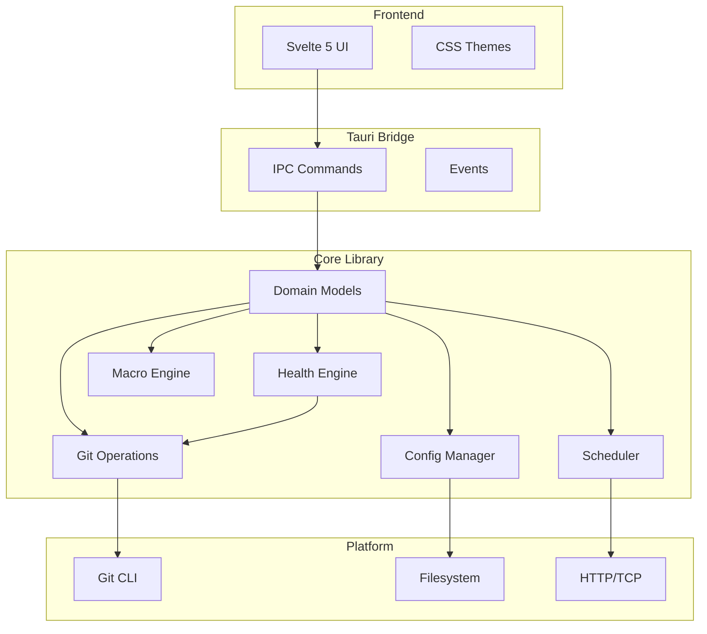
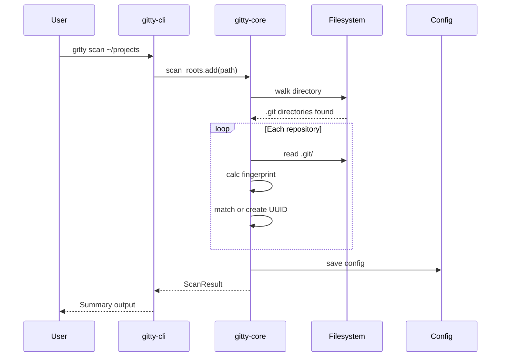
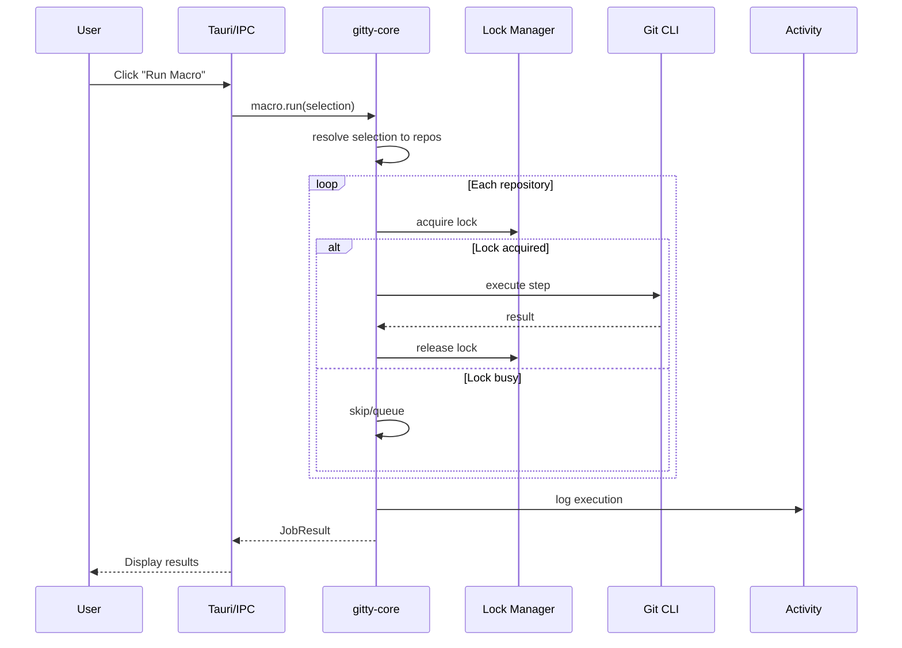
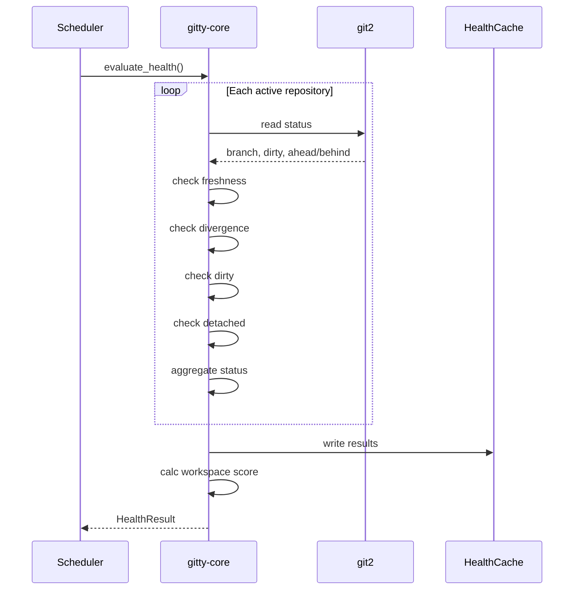

# Architecture

Gitty's architecture separates concerns across multiple layers: core business logic, platform-specific interfaces, and web-based frontend.

## High-Level Architecture



## Crate Structure

### gitty-core

The core library containing all business logic.

```
crates/gitty-core/
├── src/
│   ├── lib.rs           # Public API
│   ├── config.rs        # Config management
│   ├── repository.rs    # Repository model
│   ├── group.rs         # Group model
│   ├── tag.rs           # Tag model
│   ├── macro.rs         # Macro engine
│   ├── health.rs        # Health checks
│   ├── liveness.rs      # Liveness probes
│   ├── activity.rs       # Activity log
│   ├── scheduler.rs     # Scheduler engine
│   ├── git/             # Git operations
│   │   ├── read.rs      # Git read layer (git2)
│   │   └── write.rs     # Git write layer (shell)
│   └── error.rs         # Error types
└── Cargo.toml
```

**Key characteristics:**
- **Pure Rust** — No platform-specific code
- **Testable** — All logic unit testable
- **Sync + Async** — Core is sync, scheduler adds async
- **Error handling** — `thiserror` for structured errors

### gitty-cli

The command-line interface.

```
crates/gitty-cli/
├── src/
│   ├── main.rs          # Entry point
│   ├── commands/        # CLI subcommands
│   │   ├── mod.rs
│   │   ├── scan.rs
│   │   ├── list.rs
│   │   ├── group.rs
│   │   ├── macro.rs
│   │   └── ...
│   └── error.rs         # CLI error handling
└── Cargo.toml
```

**Key characteristics:**
- **Thin wrapper** — Most logic in core
- **anyhow** — Error handling at boundary
- **clap** — Command-line parsing
- **Scriptable** — Exit codes, JSON output

### src-tauri

The desktop application wrapper.

```
src-tauri/
├── src/
│   ├── main.rs          # Entry point
│   ├── lib.rs           # Tauri setup
│   ├── commands/        # IPC handlers
│   │   ├── mod.rs
│   │   ├── workspace.rs
│   │   ├── repository.rs
│   │   ├── health.rs
│   │   ├── liveness.rs
│   │   ├── activity.rs
│   │   └── ...
│   └── state.rs         # App state management
├── Cargo.toml
└── tauri.conf.json      # Tauri configuration
```

**Key characteristics:**
- **Stateless commands** — Config loaded per call
- **Managed state** — Mutex<Config> for caching
- **File watcher** — Notifies of external changes
- **Error strings** — Serializable errors to frontend

## Data Flow

### Repository Discovery



### Macro Execution



### Health Evaluation



## Key Design Decisions

### Git Read vs Write

| Aspect | Read | Write |
|--------|------|-------|
| **Implementation** | git2 crate | Git CLI (shell) |
| **Rationale** | Performance, safety | Compatibility, hooks |
| **Async** | Sync | Async (tokio::process) |
| **Locking** | Read locks | Write locks |

See [ADR-0001](../adr/0001-hybrid-git-execution.md) for details.

### Config File vs Database

**Decision:** Single JSON file

| Pros | Cons |
|------|------|
| Human-readable | No concurrent writes |
| Version controllable | File size limits |
| Simple backup | No complex queries |
| Portable | |

**Mitigation:** File-level locking for concurrent access.

### Sync vs Async

| Layer | Model | Rationale |
|-------|-------|-----------|
| Core | Mostly sync | Business logic simplicity |
| Git write | Async | Non-blocking I/O |
| Scheduler | Async | Background execution |
| IPC | Async | Tauri requirement |

### Error Handling Strategy

| Layer | Strategy | Type |
|-------|----------|------|
| Core | Structured | `thiserror` enums |
| CLI | Ergonomic | `anyhow` |
| IPC | Serializable | String codes |
| Frontend | User-friendly | Messages + hints |

## Component Details

### Config Manager

Responsibilities:
- Load/save config.json
- File locking
- Schema validation
- Default handling

Key features:
- Atomic writes (temp file + rename)
- Watch for external changes
- Graceful degradation on errors

### Repository Registry

Responsibilities:
- UUID assignment
- Path tracking
- Re-linking logic
- Identity persistence

Key algorithm:
```rust
// Re-linking on scan
for found_repo in discovered:
    let fingerprint = calc_root_commit_hash(&found_repo);
    if let Some(missing) = find_missing_by_fingerprint(fingerprint) {
        if count_matches(fingerprint) == 1 {
            // Unambiguous — re-link
            missing.update_path(found_repo.path);
        }
    }
```

### Health Engine

Responsibilities:
- Evaluate health checks
- Aggregate scores
- Cache results

Pluggable checks:
```rust
trait HealthCheck {
    fn name(&self) -> &str;
    fn evaluate(&self, repo: &Repository, now: DateTime) -> Status;
}
```

### Macro Engine

Responsibilities:
- Parse step definitions
- Resolve variables
- Evaluate conditions
- Execute with rollback

Step execution:
```rust
for step in &macro.steps {
    if let Some(condition) = &step.condition {
        if !condition.evaluate(repo) {
            continue; // Skip
        }
    }
    match step.execute(repo).await {
        Ok(_) => continue,
        Err(e) => {
            if let Some(rollback) = &macro.rollback {
                rollback.execute(repo).await?;
            }
            return Err(e);
        }
    }
}
```

### Scheduler

Responsibilities:
- Trigger evaluation
- Power state monitoring
- Background execution
- State persistence

Architecture:
```rust
loop {
    let next_tick = calc_next_tick(&config);
    sleep_until(next_tick).await;

    if should_run(&config, &power_state) {
        let macro = get_scheduler_macro(&config);
        macro.execute().await;
        update_last_run(&config);
    }
}
```

## Frontend Architecture

### Svelte 5 Runes

```svelte
<script>
  // State
  let repositories = $state<Repository[]>([]);

  // Derived
  let healthyCount = $derived(
    repositories.filter(r => r.health === 'healthy').length
  );

  // Effects
  $effect(() => {
    if (repositories.length > 0) {
      document.title = `Gitty (${repositories.length})`;
    }
  });
</script>
```

### IPC Pattern

```typescript
// lib/api.ts
import { invoke } from '@tauri-apps/api/core';

export async function listRepositories(): Promise<Repository[]> {
  return invoke('list_repositories');
}

// In component
import { listRepositories } from '$lib/api';

let repos = $state<Repository[]>([]);

onMount(async () => {
  repos = await listRepositories();
});
```

### Theming

CSS custom properties with data attributes:

```css
:root {
  --color-primary: #f54e00;
}

[data-theme="dark"] {
  --color-primary: #ff6b35;
}
```

Applied via:
```typescript
// Set theme
document.documentElement.setAttribute('data-theme', 'dark');

// Save to config
await invoke('set_theme', { theme: 'dark' });
```

## Performance Considerations

### Repository Scanning

- Walk directories in parallel (rayon)
- Skip common non-repo paths (.git, node_modules, target)
- Fingerprint calculation cached

### Status Reading

- git2 operations are fast (<10ms per repo)
- Lazy evaluation — only when needed
- Cached briefly in UI

### Health Evaluation

- Sequential to avoid lock contention
- Cached in health.json
- Evaluated on-demand + post-operations

### Macro Execution

- Sequential execution (locks prevent parallel)
- Per-repository timeout (5 min default)
- Progress streaming to UI

## Security Considerations

### Git Operations

- `GIT_TERMINAL_PROMPT=0` — Prevents interactive prompts
- `SSH_BATCH_MODE=yes` — Prevents SSH prompts
- Shell commands escaped — Prevents injection

### File Access

- Config directory sandboxed
- Repository paths user-controlled
- No file reads outside Git metadata

### Network

- Only connects to configured remotes
- Liveness probes user-configured
- No external API calls

## Future Architecture

Potential extensions:

### Plugin System

```rust
trait Plugin {
    fn name(&self) -> &str;
    fn health_checks(&self) -> Vec<Box<dyn HealthCheck>>;
    fn commands(&self) -> Vec<CLICommand>;
}
```

### Remote Sync

Optional cloud sync for config:
- End-to-end encrypted
- Conflict resolution
- Opt-in only

### Web Version

WASM compilation of core:
- Browser-based Git (isomorphic-git)
- Same UI via Svelte
- Limited feature set

## See Also

- [ADR Directory](../adr/) — Architecture Decision Records
- [Development](development.md) — Building from source
- [Core Concepts](../concepts/index.md) — Domain model