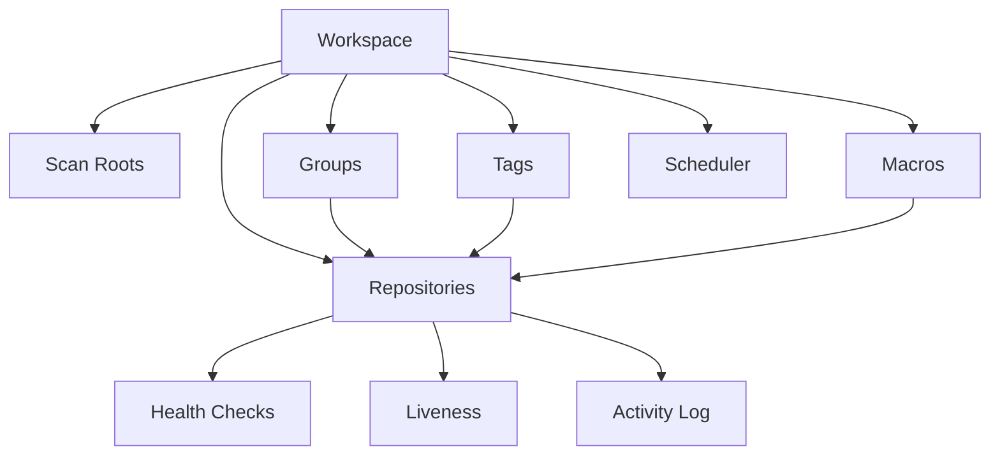
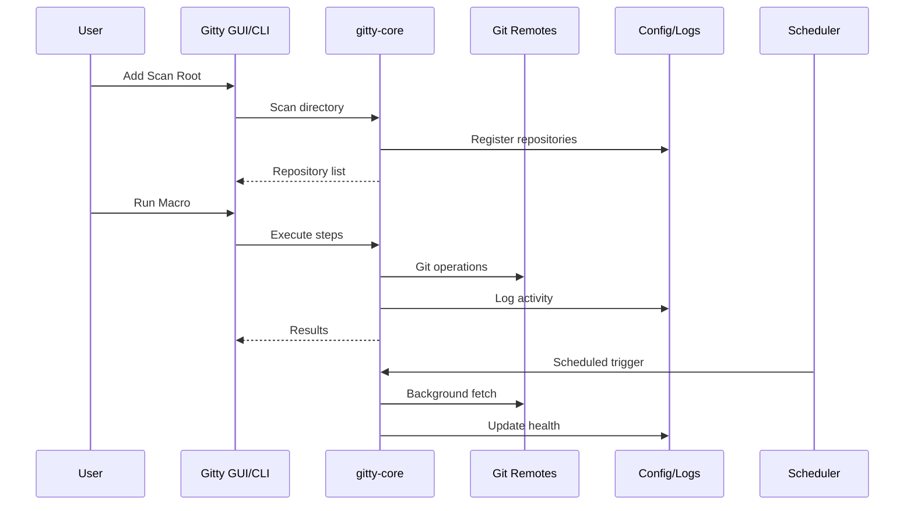

# Core Concepts

Gitty uses precise domain language. Understanding these concepts helps you navigate both the GUI and CLI effectively.

## Overview

Gitty manages a **Workspace** of **Repositories** organized into **Groups** and **Tags**. You automate operations with **Macros**, monitor health with **Health Checks**, and schedule background tasks with the **Scheduler**.

## Key Concepts

### [Workspace](domain.md#workspace)

A named collection of one or more **Scan Roots** whose repositories are managed as a single unit. The workspace has one health score, one dashboard, and one set of groups and tags.

### [Repository](repository.md)

A local Git repository discovered by scanning for `.git` directories. Each repository is identified by a Gitty-assigned UUID that survives filesystem moves via **re-linking**.

### [Groups & Tags](organization.md)

- **Groups** — Hierarchical organizational categories (e.g., `work/backend`)
- **Tags** — Cross-cutting labels (e.g., `favorite`, `needs-review`)

### [Health](health.md)

Health checks evaluate repositories against criteria like freshness, divergence, dirty state, and detached HEAD. The **Workspace Health** score aggregates results.

### [Liveness](liveness.md)

HTTP endpoint monitoring for repositories with associated services. Tracks service availability independently from Git health.

### [Macros](macros.md)

Named sequences of **Steps** (Git operations and shell commands) that target repository selections. Support variables, conditions, rollback, and confirmations.

### [Scheduler](scheduler.md)

Background automation engine that runs macros when conditions are met. Supports time-based and power-aware triggers.

### [Activity Log](activity.md)

Timestamped history of operations, macro executions, and health changes. Stored as a ring buffer with configurable retention.

## Data Flow

## Next Steps

- [Domain Model](domain.md) — Detailed terminology
- [Repository Management](repository.md) — UUIDs, re-linking, and identity
- [Organization](organization.md) — Groups and Tags in depth
- [Health System](health.md) — Health checks and scoring
- [Macros](macros.md) — Automation and scripting
- [Scheduler](scheduler.md) — Background automation